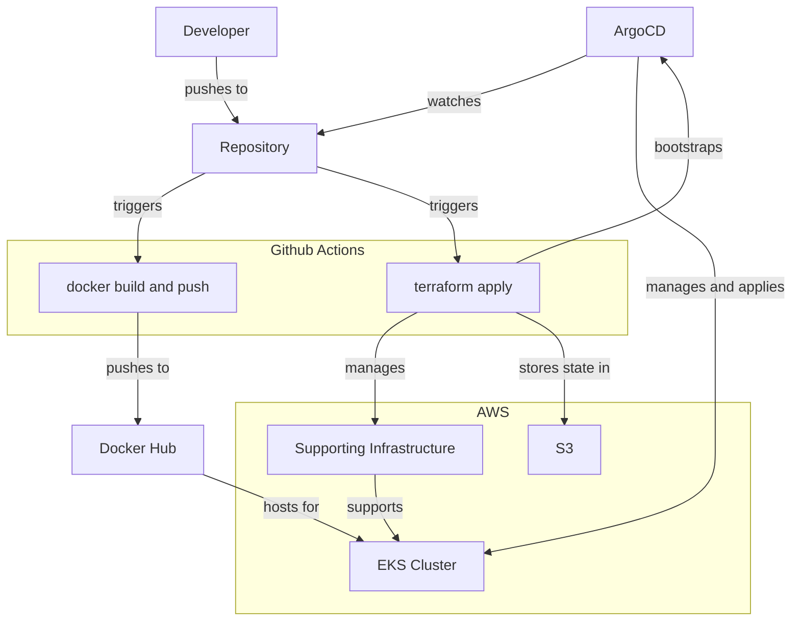

# blocky - a blockchain explorer

## Introduction

Using the following technologies:

- actix_web
- Rust
- Terraform
- Github Actions
- ArgoCD
- Kubernetes
- EKS

## Requirements

- Deploy a Web Application that interacts with the Ethereum blockchain.
- The application should accept an Ethereum address as input and return the address's current balance.
  Example Input URL:

```
trm.example.com/address/balance/0xc94770007dda54cF92009BFF0dE90c06F603a09f
```

#### Example Output JSON:

```json
{
  "balance": 0.0001365
}
```

### Integration with Infura API

- Use Infura.io to interact with the Ethereum blockchain.
- The application should call the `eth_getBalance` method via the Infura API to retrieve the Ethereum balance for a
  given address.

Infura Mainnet Endpoint:

```
https://mainnet.infura.io/v3/<api_token>
```

### Dockerization

The application must be encapsulated in a Docker Image.
The Docker image should be stored on Amazon ECR (Elastic Container Registry) or Docker Hub.

### Hosting on AWS

- Use Terraform to automate the deployment and management of the application's infrastructure on AWS.
- Ensure that the deployment can be easily repeated or modified using Terraform scripts.

### Demo Guidelines

Be ready to present a live demonstration that includes:

- Issuing an API call to retrieve the Ethereum balance.
- Coding and deploying a new feature.
- Deploying the new feature through a CI/CD pipeline.

### CI/CD Pipeline

- Implement a CI/CD pipeline to automate the deployment of new features.
- The pipeline should handle infrastructure changes, application updates, and Kubernetes deployments.
  GitHub Repository

## Usage

**NOTE: All links are only accessible to my own IP Address for security purposes.**

Api Endpoint: http://api.solventdj.com/api

[API Documentation](http://api.solventdj.com/scalar)

[ArgoCD](http://argocd.solventdj.com)

[GH Actions](https://github.com/solventak/fantastic-octo-disco/actions)

## CI/CD



In order to automate deploys of infrastructure and application code I used a combination of Terraform and ArgoCD.

The docker image is built on Github Actions and after it is built it rolls out the changes with a restart to
the `blocky` deployment on Kubernetes to update the image for the application.

Terraform runs on Github Actions and deploys changes to the AWS architecture. Terraform bootstraps ArgoCD on the
Kubernetes cluster as well, but that is the only thing that it configures on the Kubernetes cluster.

ArgoCD is used to manage continuous deployment of application code. ArgoCD is configured to watch the Github repository
for changes and automatically deploy new versions of the application code to the Kubernetes cluster.

Terraform applies changes automatically, while ArgoCD requires a manual sync. It could be configured otherwise but I
prefer to have the control over the change to the application architecture. As described above, the actual `blocky` API
will restart and roll out new pods with the latest built image automatically.

## Security Considerations

### Network and Communication Security
- [ ] Enable SSL for all network calls
- [ ] Security groups in AWS should be reviewed to allow minimal access across all vectors

### Access Control and Identity Management
- [ ] Add an identity provider to allow users to access the API
- [ ] Lock down users and roles in Kubernetes to make secrets inaccessible
- [x] ArgoCD has its own identity management but this should be locked down more
  - I just limited it to my own IP
- [x] Lock down the repo so only authorized people can push, since it triggers actions
- [ ] Audit logging for access to all resources that aren't public

### Secrets and Sensitive Data Management
- [x] Avoid storing sensitive environment variables in the Docker image
- [x] API Keys and Secrets should be managed separately
  - Currently stored in Kubernetes secrets which were uploaded manually
- [x] Terraform state can be sensitive, so ensure that the bucket is private
- [x] Secrets for CI should be managed
  - Currently stored in GitHub secrets for actions

### Rate Limiting and Abuse Prevention
- [ ] Rate limits based on IP, token, etc.
- [ ] Blacklist for bad actors
- [ ] Rate limits to prevent abuse

### Application and Infrastructure Security
- [ ] Application should validate input for addresses
- [ ] Pod security policies
- [ ] EKS cluster configuration with service accounts for pods
- [ ] Control plane logging

### Logging and Monitoring
- [x] Check all logging and monitoring to ensure tokens are redacted or removed completely if exposed

## High Availability (HA) Considerations

### Redundancy

- [x] 2 Availability Zones (AZs)
- [x] 2 Nodes per AZ
- [x] Pod spread topology to distribute pods evenly across all nodes

### Health Checks

- [x] Blocky server includes a health check endpoint

### Horizontal Scaling

- [x] Managed by Kubernetes with redundancy across nodes and AZs

### Failover

- [x] Handled through the redundancy design

### Stateless Applications

- [x] Application is designed to be stateless for easier scaling and recovery

### Retry Logic

- [x] Implemented to handle transient failures

Graceful Degradation (To Be Implemented)

Serve from cache if the service goes down
Circuit Breaker (To Be Implemented)

Introduce a circuit breaker to prevent cascading failures

## Scalability Considerations

- [ ] cache with redis

## Monitoring and Alerts

- alerting
- monitoring system
  - this ties in with HA

## Contributing
